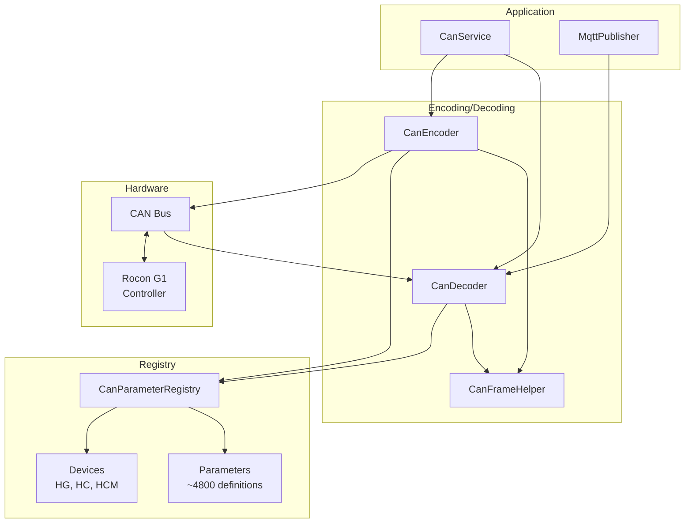
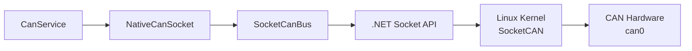
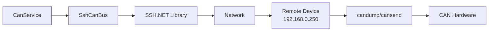
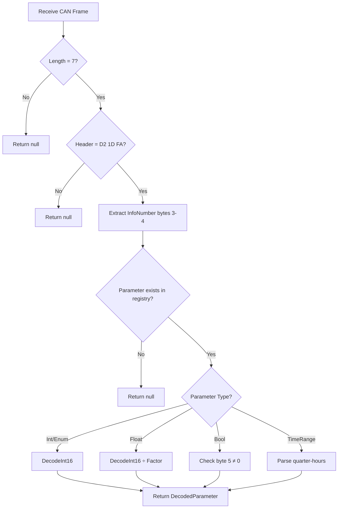
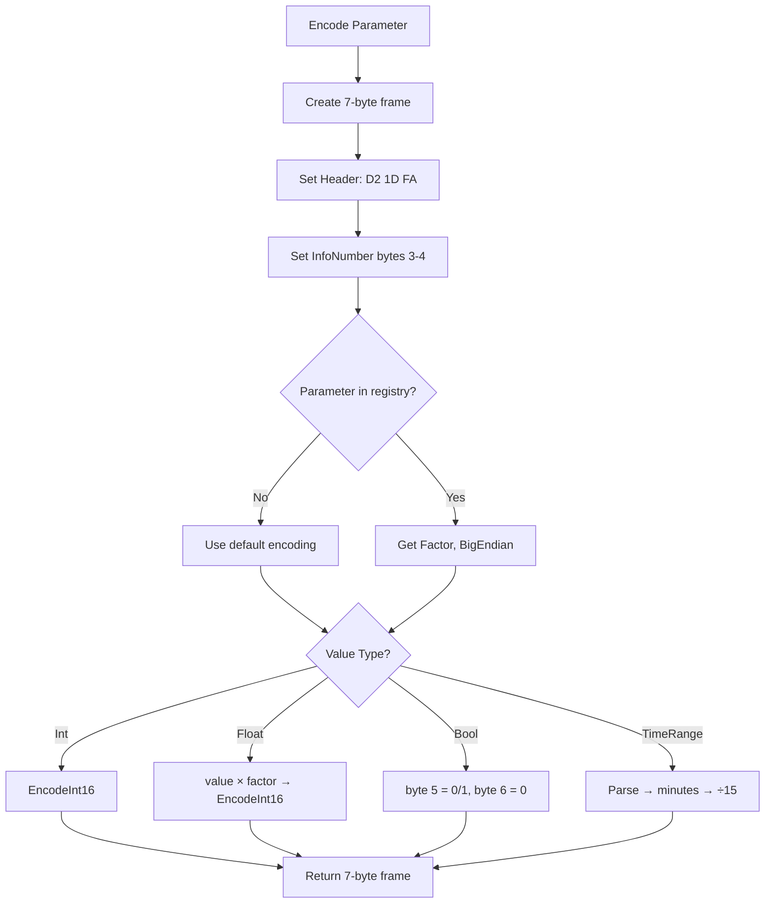
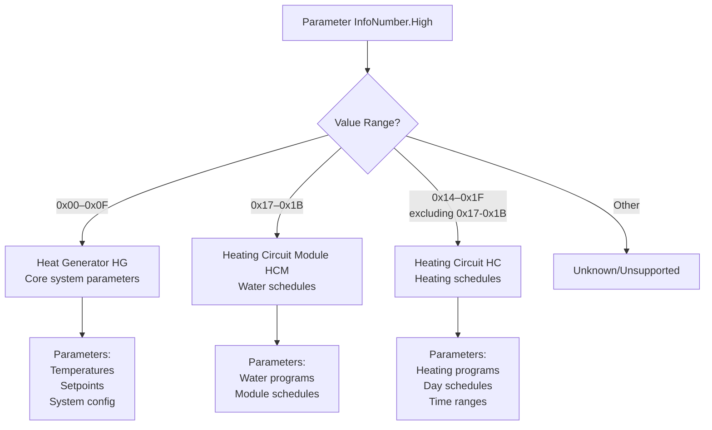
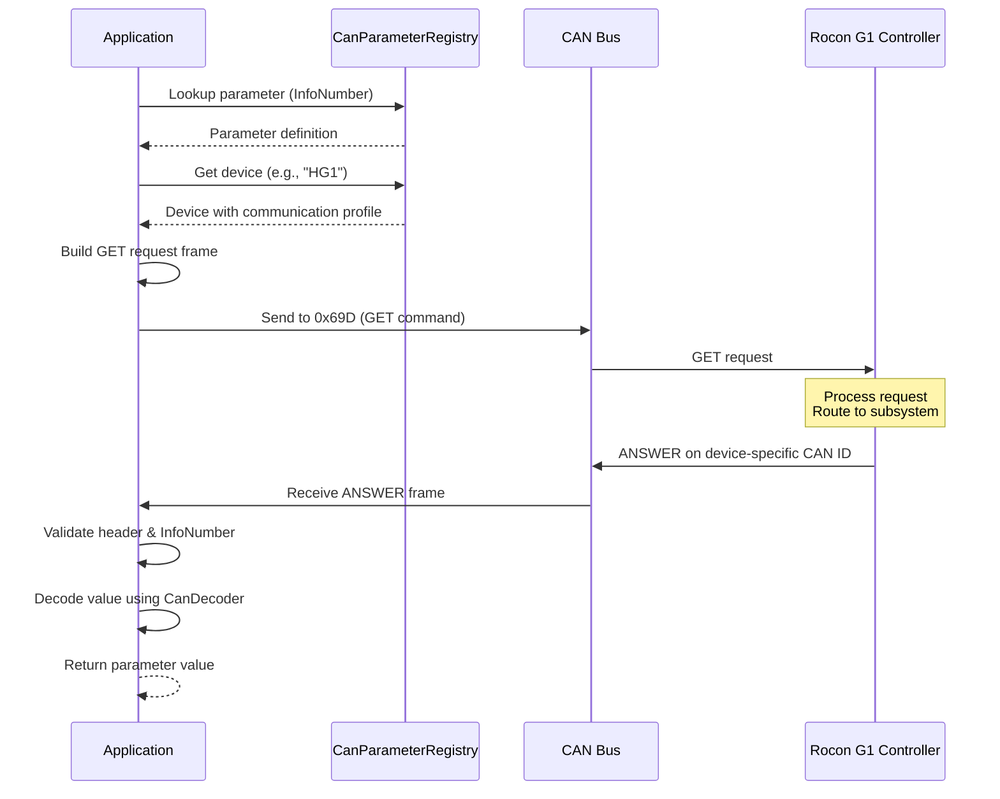
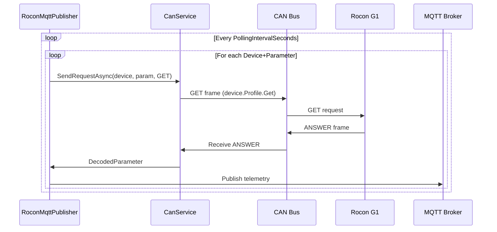

# CAN Bus Communication System

## Overview

The RoconMqtt system communicates with Rotex Rocon G1 heating controllers over CAN bus using a standardized request/response protocol. This document describes the complete CAN communication architecture, parameter encoding/decoding, and device communication patterns.

## System Architecture



## CAN Bus Access Layer

The system supports two methods for accessing the CAN bus:

### 1. Native SocketCAN (Linux)

**Implementation:** `NativeCanSocket` uses native .NET `Socket` APIs with P/Invoke for direct SocketCAN access.



**Characteristics:**
- **Zero external dependencies** - Uses only .NET BCL types (`System.Net.Sockets.Socket`)
- **Low-level P/Invoke** - Direct system calls for `AF_CAN` (29) socket family
- **High performance** - Direct kernel access without intermediate libraries
- **Platform-specific** - Linux only (requires SocketCAN kernel module)
- **Automatic reconnection** - Built-in retry logic with exponential backoff

**Usage:** Automatically selected when no SSH configuration is present.

### 2. SSH Remote Access

**Implementation:** `SshCanBus` uses SSH.NET to remotely execute `candump` and `cansend` on a CAN gateway device.



**Characteristics:**
- **Platform-independent** - Works on Windows, Linux, macOS
- **Remote CAN access** - Connect to CAN gateway over network
- **No local hardware required** - Ideal for development machines
- **Higher latency** - Network + SSH overhead vs direct kernel access

**Usage:** Automatically selected when `Can:Ssh` section is configured in `appsettings.json`.

### Configuration

The system automatically selects the appropriate CAN bus implementation:

```json
{
  "Can": {
    "CanInterfaceName": "can0",
    "Ssh": null  // Native SocketCAN (default)
  }
}
```

```json
{
  "Can": {
    "CanInterfaceName": "can0",
    "Ssh": {
      "Host": "192.168.0.250",
      "Username": "root",
      "Password": "your-password"
    }  // SSH remote access
  }
}
```

See **[SSH_CAN_BUS.md](SSH_CAN_BUS.md)** for detailed SSH configuration and troubleshooting.

## CAN Frame Structure

All frames are **exactly 7 bytes**:

```
Byte 0-2:  Header (0xD2, 0x1D, 0xFA)
Byte 3-4:  InfoNumber (High, Low)
Byte 5-6:  Value (parameter-specific encoding)
```

### Example Frame

```
D2 1D FA 0A 06 01 E0
│  │  │  │  │  └──┴── Value: 0x01E0 (480 decimal)
│  │  │  └──┴─────── InfoNumber: 0x0A06
└──┴──┴──────────── Header: Fixed
```

## Parameter System

### Parameter Registry

The `CanParameterRegistry` contains all parameter definitions indexed by `InfoNumber`. Each parameter has:

| Property | Description | Example |
|----------|-------------|---------|
| Name | Human-readable identifier | `cEINSTELL_SPEICHERSOLLTEMP2` |
| InfoNumber | Unique 2-byte identifier (High, Low) | `0x0A06` |
| Type | Data type (Int, Float, Bool, TimeRange, Enum) | `ParameterType.Float` |
| Factor | Scaling multiplier for numeric values | `10` |
| BigEndian | Byte order for 16-bit values | `true` |
| Min/Max | Valid value range | `10`, `70` |
| Default | Default value | `48` |
| Writeable | Can be written via SET command | `true` |

### Parameter Types

#### 1. Integer (Int)
- Raw 16-bit signed integer
- Endianness determined by parameter definition
- Example: Day value (0-31)

**Encoding:** `value → 16-bit int → 2 bytes`  
**Decoding:** `2 bytes → 16-bit int → value`

#### 2. Float
- Integer scaled by factor (e.g., factor 10 for temperature)
- Actual value: 48.0°C → Encoded: 48.0 × 10 = 480 = 0x01E0

**Encoding:** `value × factor → 16-bit int → 2 bytes`  
**Decoding:** `2 bytes → 16-bit int ÷ factor → value`

#### 3. Boolean (Bool)
- Byte 5: 0 (false) or 1 (true)
- Byte 6: Always 0

**Encoding:** `true → 0x01, false → 0x00`

#### 4. Time Range (TimeRange)
- Format: `"HH:MM-HH:MM"` (e.g., `"06:00-22:00"`)
- Encoded as quarter-hour indices (0-95 represents 00:00-23:45)
- Each index = 15 minutes
- Example: 08:30 = (8×60 + 30) ÷ 15 = 34

**Special Values:**
- `0x80` (Off Marker): Disabled time slot → decoded as 00:00
- Values ≥ 96: Capped to 95 (max 23:45)

**Encoding:** `"HH:MM-HH:MM" → minutes → ÷15 → 2 bytes (0-95)`  
**Decoding:** `2 bytes → ×15 → minutes → "HH:MM-HH:MM"`

#### 5. Enum
- Treated as Int type with named values
- Values mapped via `EnumValues` dictionary
- Example: Program switch (1, 3, 4, 5, 11, 12, 17)

## Decoding Process



**CanDecoder** validates the frame, looks up parameter metadata, and decodes the value based on type.

## Encoding Process



**CanEncoder** creates a 7-byte frame with the correct header, InfoNumber, and type-specific value encoding.

## Subsystems and Devices

### Subsystem Architecture

The Rocon G1 controller organizes parameters into three subsystems, determined by **InfoNumber.High byte**:



**Important:** Range 0x17–0x1B overlaps with HC (0x14–0x1F), but **HCM takes precedence** for this range.

### Subsystem Parameter Assignment

All devices within a subsystem share the same parameter set based on InfoNumber.High byte:

- **All HG devices (HG1-HG8)** can access parameters with InfoNumber.High in `0x00–0x0F`
- **All HC devices (HC1-HC16)** can access parameters with InfoNumber.High in `0x14–0x1F` (excluding HCM range)
- **All HCM devices (HCM1-HCM16)** can access parameters with InfoNumber.High in `0x17–0x1B`

### Communication Protocol

Each subsystem uses specific communication opcodes:

| Subsystem | InfoNumber.High | GET Opcode | SET Opcode | Answer CAN ID Base | Devices |
|-----------|-----------------|------------|------------|-------------------|---------|
| Heat Generator (HG) | 0x00–0x0F | 0x31 | 0x30 | 0x180–0x187 | HG1–HG8 |
| Heating Circuit (HC) | 0x14–0x1F* | 0x61 | 0x60 | 0x300–0x30F | HC1–HC16 |
| Heating Circuit Module (HCM) | 0x17–0x1B* | 0xC1 | 0xC0 | 0x600–0x60F | HCM1–HCM16 |

*HCM range (0x17–0x1B) takes precedence over HC range

### Device Instances

Each subsystem has multiple device instances with unique sequence bytes and answer CAN IDs:

#### Heat Generators (HG1-HG8)

| Device | GET Sequence | SET Sequence | Answer CAN ID |
|--------|--------------|--------------|---------------|
| HG1 | `0x31, 0x00, 0xFA` | `0x30, 0x00, 0xFA` | `0x180` |
| HG2 | `0x31, 0x01, 0xFA` | `0x30, 0x01, 0xFA` | `0x181` |
| ... | ... | ... | ... |
| HG8 | `0x31, 0x07, 0xFA` | `0x30, 0x07, 0xFA` | `0x187` |

#### Heating Circuits (HC1-HC16)

| Device | GET Sequence | SET Sequence | Answer CAN ID |
|--------|--------------|--------------|---------------|
| HC1 | `0x61, 0x00, 0xFA` | `0x60, 0x00, 0xFA` | `0x300` |
| HC2 | `0x61, 0x01, 0xFA` | `0x60, 0x01, 0xFA` | `0x301` |
| ... | ... | ... | ... |
| HC16 | `0x61, 0x0F, 0xFA` | `0x60, 0x0F, 0xFA` | `0x30F` |

#### Heating Circuit Modules (HCM1-HCM16)

| Device | GET Sequence | SET Sequence | Answer CAN ID |
|--------|--------------|--------------|---------------|
| HCM1 | `0xC1, 0x00, 0xFA` | `0xC0, 0x00, 0xFA` | `0x600` |
| HCM2 | `0xC1, 0x01, 0xFA` | `0xC0, 0x01, 0xFA` | `0x601` |
| ... | ... | ... | ... |
| HCM16 | `0xC1, 0x0F, 0xFA` | `0xC0, 0x0F, 0xFA` | `0x60F` |

## GET Request / ANSWER Response Cycle

### Protocol Flow



### GET Request Format

**CAN ID:** Always `0x69D` (broadcast request ID)

**Payload (8 bytes):**
```
[0]    = GET opcode (subsystem-specific: 0x31/0x61/0xA1)
[1]    = Sequence byte 1 (device-specific: 0x00-0x0F)
[2]    = Sequence byte 2 (always 0xFA)
[3]    = InfoNumber High byte
[4]    = InfoNumber Low byte
[5-7]  = Unused (typically 0x00)
```

**Example: Read parameter 0x0A06 from HG1**
```
CAN ID: 0x69D
Payload: 31 00 FA 0A 06 00 00 00
         │  │  │  │  │
         │  │  │  └──┴── InfoNumber: 0x0A06
         │  └──┴─────── Sequence: HG1
         └──────────── Opcode: HG GET
```

### ANSWER Response Format

**CAN ID:** Device-specific (e.g., 0x180 for HG1, 0x300 for HC1, 0x600 for HCM1)

**Payload (7 bytes):**
```
[0]    = Response opcode (always 0xD2)
[1]    = Response header (always 0x1D)
[2]    = Response header (always 0xFA)
[3]    = InfoNumber High byte (echoes request)
[4]    = InfoNumber Low byte (echoes request)
[5-6]  = Parameter value (16-bit, encoding depends on type)
```

**Example: Response from HG1**
```
CAN ID: 0x180
Payload: D2 1D FA 0A 06 01 E0
         │  │  │  │  │  └──┴── Value: 0x01E0 (480)
         │  │  │  └──┴─────── InfoNumber: echoes request
         └──┴──┴──────────── Header: always D2 1D FA
```

### Implementation Pattern

**Step 1: Determine Subsystem from InfoNumber**
Use `GetSubsystemForParameter()` to identify which subsystem (HG/HC/HCM) based on InfoNumber.High byte.

**Step 2: Select Target Device**
Choose specific device instance (e.g., HG1, HC5, HCM10) using `GetDevice(name)`.

**Step 3: Build GET Request**
Construct 8-byte frame with:
- Opcode from device profile
- Sequence bytes from device profile
- InfoNumber from parameter

**Step 4: Send and Wait**
- Send on CAN ID 0x69D
- Wait for response on device's Answer CAN ID
- Timeout: typically 500-1000ms

**Step 5: Validate Response**
- Check header bytes (0xD2, 0x1D, 0xFA)
- Verify InfoNumber matches request

**Step 6: Decode Value**
Pass 7-byte ANSWER frame to `CanDecoder.Decode()` to get typed value.

## SET Command (Writing Parameters)

### SET Request Format

**CAN ID:** Always `0x69D` (same as GET)

**Payload (7 bytes):**
```
[0]    = SET opcode (subsystem-specific: 0x30/0x60/0xA0)
[1]    = Sequence byte 1 (device-specific: 0x00-0x0F)
[2]    = Sequence byte 2 (always 0xFA)
[3]    = InfoNumber High byte
[4]    = InfoNumber Low byte
[5-6]  = New parameter value (encoded)
```

**Example: Write temperature 45.5°C to HG1 parameter 0x0A06**
```
Encode: 45.5 × 10 = 455 = 0x01C7

CAN ID: 0x69D
Payload: 30 00 FA 0A 06 01 C7
         │  │  │  │  │  └──┴── Value: 455 (45.5°C)
         │  │  │  └──┴─────── InfoNumber: 0x0A06
         │  └──┴─────────────Sequence: HG1
         └────────────────── Opcode: HG SET (0x30)
```

The controller typically responds with an ANSWER frame containing the accepted value.

## Helper Utilities

### CanFrameHelper

Provides centralized byte and time operations:

#### Byte Operations
- `EncodeInt16(frame, offset, value, bigEndian)` - Encode 16-bit integer
- `DecodeInt16(data, offset, bigEndian)` - Decode 16-bit integer

#### Time Operations
- `ParseTimeToMinutes(time)` - Convert "HH:MM" to minutes
- `FormatMinutesToTime(minutes)` - Convert minutes to "HH:MM"
- `MinutesToQuarterHour(minutes)` - Convert minutes to index (0-95)
- `QuarterHourToMinutes(quarterHour)` - Convert index to minutes

## Constants

| Constant | Value | Description |
|----------|-------|-------------|
| HeaderByte0 | 0xD2 | Frame header byte 0 |
| HeaderByte1 | 0x1D | Frame header byte 1 |
| HeaderByte2 | 0xFA | Frame header byte 2 |
| StandardFrameLength | 7 | CAN frame payload size |
| MinutesPerQuarterHour | 15 | Time resolution |
| MaxQuarterHourIndex | 95 | Represents 23:45 |
| OffMarker | 0x80 | Inactive time slot marker |
| QuarterHourCapValue | 96 | Value capped to 95 |

## Error Handling

| Error | Handling |
|-------|----------|
| Frame too short | Log debug message, return null |
| Invalid header | Log debug message, return null |
| Unknown parameter | Log debug message, return null |
| Decoding exception | Log error with parameter name, return null |
| GET timeout | Log warning, return null, retry with backoff |
| Invalid response header | Log error, discard frame |
| InfoNumber mismatch | Log error, wait for next response |

## Testing

Round-trip consistency is maintained between encoding and decoding:

**Test Pattern:**
1. Encode a value to bytes
2. Decode the bytes back to value
3. Verify original value matches decoded value

**Example Test Cases:**
- Float with factor: 48.0 → encode → decode → 48.0
- TimeRange: "08:30-16:45" → encode → decode → "08:30-16:45"
- Bool: true → encode → decode → true
- Int: 25 → encode → decode → 25

## CAN Bus Recording

The system provides a CAN bus recording feature for reverse engineering parameter mappings on different Rocon hardware variants.

### Purpose

- **Reverse Engineering:** Capture raw CAN traffic to identify unknown parameters
- **Parameter Discovery:** Map InfoNumbers to physical thermostat actions
- **Value Encoding Analysis:** Determine encoding schemes for different parameter types
- **Device Identification:** Match CAN IDs to device instances

### Recording Service

**CanRecordingService** is a background service that continuously monitors CAN bus traffic and stores frames when recording is active.

**Features:**
- Start/stop recording via REST API
- Optional CAN ID filtering
- Timestamp each captured frame
- Export in candump format
- Non-invasive (does not interfere with normal operation)

### Workflow

1. **Disable MQTT Publishing** (optional, to reduce bus traffic)
   ```bash
   curl -X PUT "http://localhost:5000/api/mqtt/status" \
     -H "Content-Type: application/json" \
     -d '{"enabled": false}'
   ```

2. **Start Recording**
   ```bash
   curl -X POST "http://localhost:5000/api/can/recording/start" \
     -H "Content-Type: application/json" \
     -d '{
       "canIdFilter": ["0x180", "0x300", "0x600"],
       "description": "Testing temperature setpoint"
     }'
   ```

3. **Manipulate Thermostat**
   - Change temperature setpoint
   - Switch operating modes
   - Adjust schedules
   - Enable/disable features

4. **Stop Recording & Export**
   ```bash
   curl -X POST "http://localhost:5000/api/can/recording/stop/export" > recording.log
   ```

5. **Analyze Output**
   - Look for ANSWER frames (header: `D2 1D FA`)
   - Identify InfoNumber patterns (bytes 3-4)
   - Compare before/after values
   - Document encoding schemes

### Output Format

**Candump Format:**
```
# CAN Recording Session
# Started: 2024-12-20 14:30:00.000 UTC
# Stopped: 2024-12-20 14:35:00.000 UTC
# Duration: 300.000 seconds
# Frame Count: 1523
# Description: Testing temperature setpoint
# Filter: 0x180, 0x300, 0x600
#
(2024-12-20 14:30:00.123) 0x180#D2 1D FA 00 0C 01 E0
(2024-12-20 14:30:01.456) 0x300#D2 1D FA 01 12 00 FA
(2024-12-20 14:30:02.789) 0x180#D2 1D FA 00 0D 02 A0
```

### Analysis Tips

**Identifying Parameters:**
1. Record baseline state (no changes)
2. Make single thermostat change
3. Compare recordings to find changed InfoNumber
4. Repeat for different values to determine encoding

**Decoding Values:**
- **Temperature:** Usually factor 10 (e.g., 480 = 48.0°C)
- **Boolean:** Byte 5: 0x00 (false) or 0x01 (true)
- **TimeRange:** Quarter-hour indices (0-95)
- **Enum:** Integer values mapped to named states

**CAN ID Mapping:**
- `0x180-0x187` → Heat Generators (HG1-HG8)
- `0x300-0x30F` → Heating Circuits (HC1-HC16)
- `0x600-0x60F` → Heating Circuit Modules (HCM1-HCM16)

**InfoNumber Ranges:**
- `0x00-0x0F` → Heat Generator parameters
- `0x14-0x1F` → Heating Circuit parameters
- `0x17-0x1B` → Heating Circuit Module parameters (subset of HC)

### REST API Endpoints

See **[API.md](API.md#10-start-can-bus-recording)** for complete API documentation.

- `POST /api/can/recording/start` - Start recording
- `POST /api/can/recording/stop` - Stop and get JSON
- `POST /api/can/recording/stop/export` - Stop and export as candump format
- `GET /api/can/recording/status` - Check recording status

### Best Practices

✅ **Do:**
- Disable MQTT publishing during recording to reduce noise
- Use CAN ID filters to focus on specific devices
- Make isolated changes (one parameter at a time)
- Document each recording session with descriptions
- Compare multiple recordings for consistency

❌ **Don't:**
- Leave recording running indefinitely (memory usage)
- Make multiple thermostat changes simultaneously
- Forget to stop recording before analysis
- Ignore baseline recordings

## Why InfoNumber Ranges Map to Subsystems

### Subsystem Detection Uses InfoNumber.High

The Rocon G1 firmware internally groups parameters into functional modules. Each module owns a contiguous range of InfoNumber.High values, and the firmware uses this byte to route GET/SET requests to the correct subsystem.

This behavior is observable from the controller's CAN responses:

1. **Heat Generator (0x00–0x0F):** Core system parameters (temperatures, setpoints, operating modes). Controller always responds on CAN IDs 0x180–0x187 with GET opcode 0x31.

2. **Heating Circuit (0x14–0x1F):** Heating program schedules, day schedules, time ranges. Controller responds on 0x300–0x30F with GET opcode 0x61.

3. **Heating Circuit Module (0x17–0x1B):** Water programs and module-specific schedules. Controller responds on 0x600–0x60F with GET opcode 0xC1. This range overlaps with HC but takes precedence.

### Parameter Routing vs Device Instances

The `data.json` file defines **device instances** (HG1–HG8, HC1–HC16, HCM1–HCM16). These entries describe how to communicate with each device:

- Which GET opcode to use
- Which SET opcode to use
- Which sequence bytes to send
- Which CAN ID the device answers on

However, the JSON **does not** specify which parameters belong to which subsystem.

**Parameter routing is determined by InfoNumber.High:**

The Rocon G1 firmware internally groups parameters by the **high byte** of the InfoNumber. This byte determines which subsystem owns the parameter and therefore which GET opcode and answer CAN ID apply.

| InfoNumber.High Range | Subsystem | Notes |
|------------------------|-----------|-------|
| 0x00–0x0F | Heat Generator (HG) | Core system parameters |
| 0x14–0x1F | Heating Circuit (HC) | Heating schedules |
| 0x17–0x1B | Heating Circuit Module (HCM) | Warm‑water schedules (subset of HC) |

Because 0x17–0x1B is a subset of the HC range, **HCM must be checked first**:

1. If 0x00–0x0F → Heat Generator
2. Else if 0x17–0x1B → Heating Circuit Module *(precedence)*
3. Else if 0x14–0x1F → Heating Circuit

### Why This Does Not Conflict With the JSON

- The JSON lists **device instances**, not **parameter ownership**
- The JSON tells you how to talk to HG1/HC1/HCM1, not which parameters belong to them
- The firmware itself decides routing based on InfoNumber.High, not on the JSON

**In practice:**
- All HG devices (HG1-HG8) share the same parameter set (InfoNumber.High 0x00–0x0F)
- All HC devices (HC1-HC16) share the same parameter set (InfoNumber.High 0x14–0x1F, excluding HCM)
- All HCM devices (HCM1-HCM16) share the same parameter set (InfoNumber.High 0x17–0x1B)

The subsystem determination logic (`GetSubsystemForParameter()`) is correct, necessary, and independent of the JSON instance list.

## GET/ANSWER Communication Cycle

The system implements a polling mechanism to regularly query parameter values from the controller:

1. **Configuration** - Specify devices and parameters in `appsettings.json`:
   ```json
   "Mqtt": {
     "Devices": ["HG1", "HC1"],
     "Parameters": ["cAUSSENTEMP", "cTAG"],
     "PollingIntervalSeconds": 5,
     "ResponseTimeoutSeconds": 1
   }
   ```

2. **Polling Loop** - `RoconMqttPublisher` iterates through all device/parameter combinations:
   - Sends GET request via `CanService.SendRequestAsync(deviceName, paramName, CommandType.Get, null, token)`
   - Waits for ANSWER response (with timeout)
   - Publishes decoded parameter to MQTT topic
   - Repeats for next parameter after timeout or successful response

### Communication Flow



## API Reference

### CanService

**Methods:**
- `SendRequestAsync(string deviceName, string parameterName, CommandType commandType, object? value, CancellationToken token)` - Send GET or SET request for a specific device and parameter. CommandType determines request type:
  - `CommandType.Get` - Read parameter value (value parameter ignored)
  - `CommandType.Set` - Write parameter value (value parameter required)
  - `CommandType.Answer` - Not allowed (throws exception - ANSWER frames are responses from controller)
- `ListenForResponses(Func<DecodedParameter, Task> responseAction, CancellationToken token)` - Start listening for ANSWER frames and invoke callback for each decoded parameter

### CanParameterRegistry

**Static Properties:**
- `Parameters` - Dictionary of all parameter definitions (InfoNumber → ParameterDefinition)
- `HeatGenerators` - List of HG1-HG8 devices with communication profiles
- `HeatingCircuits` - List of HC1-HC16 devices with communication profiles
- `HeatingCircuitModules` - List of HCM1-HCM16 devices with communication profiles

**Static Methods:**
- `GetSubsystemForParameter(InfoNumber)` → `DeviceType?` - Determine subsystem from InfoNumber.High
- `GetHeatGenerator(string name)` → `CanDevice?` - Get specific HG device
- `GetHeatingCircuit(string name)` → `CanDevice?` - Get specific HC device
- `GetHeatingCircuitModule(string name)` → `CanDevice?` - Get specific HCM device
- `GetDevice(string name)` → `CanDevice?` - Get any device by name (searches all types)

### CanDecoder

**Methods:**
- `Decode(byte[] data, CommunicationCommand command)` → `DecodedParameter?` - Decode CAN frame (GET/SET/ANSWER) to parameter value. Validates header against command bytes and decodes InfoNumber and value.

### CanEncoder

**Methods:**
- `Encode(CommunicationCommand command, InfoNumber info, object value)` → `byte[]` - Encode parameter value to CAN frame using specified command (GET/SET/ANSWER). Frame size is 7 bytes for ANSWER frames or may differ for GET/SET frames based on command configuration.

### Data Models

**CommandType** - CAN communication command type (enum)
- `Get` - GET command - request to read parameter value from controller
- `Set` - SET command - request to write parameter value to controller
- `Answer` - ANSWER command - response from controller containing parameter value

**CanDevice** - Device instance with communication profile
- `Name` - Device identifier (e.g., "HG1")
- `Type` - DeviceType enum (HeatGenerator, HeatingCircuit, HeatingCircuitModule)
- `Profile` - CommunicationProfile with GET/SET/ANSWER commands

**CommunicationProfile** - Device communication commands
- `Name` - Profile name
- `Get` - CommunicationCommand for GET requests
- `Set` - CommunicationCommand for SET requests
- `Answer` - CommunicationCommand for ANSWER responses

**CommunicationCommand** - Single CAN command
- `CanId` - CAN identifier (uint)
- `Bytes` - Command bytes (byte[])

**ParameterDefinition** - Parameter metadata
- `Name` - Parameter name
- `InfoNumber` - Unique identifier
- `Type` - ParameterType enum
- `Factor` - Scaling factor
- `BigEndian` - Byte order flag
- `Min/Max` - Value range
- `Writeable` - Read-only flag

**DecodedParameter** - Decoded parameter result
- `Name` - Parameter name
- `Value` - Decoded value (object)
- `Definition` - Source ParameterDefinition

## Configuration

### MQTT Publisher Configuration

The MQTT publisher polls CAN parameters and publishes them to an MQTT broker. For complete MQTT configuration options including:
- Home Assistant auto-discovery
- Compound parameters (e.g., Timestamp)
- Change detection thresholds
- TLS/SSL settings
- Resilience policies

See **[MQTT.md](MQTT.md)** for detailed documentation.

**Minimal Example:**
```json
{
  "Mqtt": {
    "Host": "192.168.0.254",
    "Port": 1883,
    "ClientId": "rocon-publisher",
    "Topic": "rocon",
    "Devices": ["HG1"],
    "Parameters": ["cAUSSENTEMP", "cTAG", "cMONAT"],
    "CompoundParameters": ["Timestamp"],
    "PollingIntervalSeconds": 30,
    "ResponseTimeoutSeconds": 1,
    "ChangeThresholdPercent": 1.0,
    "HomeAssistant": {
      "Discovery": true,
      "DiscoveryPrefix": "homeassistant"
    }
  }
}
```

**Key MQTT Options:**
- `Devices` - List of device names to query (HG1-HG8, HC1-HC16, HCM1-HCM16)
- `Parameters` - List of parameter names from registry
- `CompoundParameters` - Synthetic parameters combining multiple values (e.g., "Timestamp")
- `PollingIntervalSeconds` - Seconds between polling cycles (default: 30)
- `ResponseTimeoutSeconds` - Timeout for CAN responses (default: 1)
- `ChangeThresholdPercent` - Minimum change to publish (default: 1.0%)

## Related Documentation

### Core Documentation
- **[MQTT.md](MQTT.md)** - MQTT publisher, Home Assistant integration, compound parameters

### Implementation Files
- `RoconMqttPublisher.cs` - Background service implementing GET/ANSWER polling cycle
- `CanService.cs` - CAN communication service with GET/SET request methods
- `ICanService.cs` - Service interface for CAN communication

### Registry and Encoding
- `CanParameterRegistry.cs` - Central parameter and device registry (~4800 parameters)
- `CanDecoder.cs` - Decodes CAN frames to parameter values
- `CanEncoder.cs` - Encodes parameter values to CAN frames
- `CanFrameHelper.cs` - Byte and time conversion utilities
- `CanConstants.cs` - System constants
- `data.json` - Source data for parameter definitions
