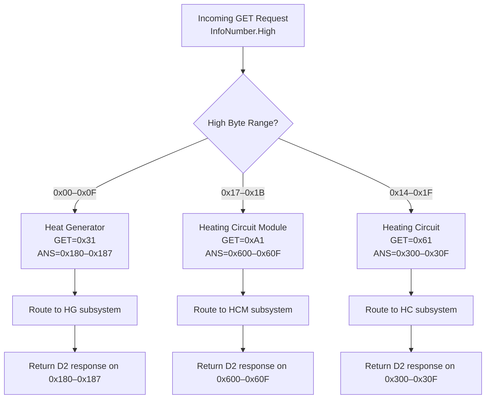

# CAN Parameter Encoding/Decoding System

## Overview

The CAN parameter system in RoconMqtt is responsible for encoding and decoding device parameters transmitted over CAN bus. It provides a type-safe, registry-based approach to handling various parameter types with support for endianness, scaling factors, and time range specifications.

## Architecture

```
┌─────────────────────────────────────────────────────────┐
│                  Application Layer                       │
│         (RoconService, MqttPublisher, etc.)             │
└────────────────────┬────────────────────────────────────┘
                     │
        ┌────────────┴─────────────┐
        │                          │
   ┌────▼──────┐        ┌─────────▼──────┐
   │CanDecoder │◄──────►│CanEncoder      │
   └────┬──────┘        └─────────┬──────┘
        │                          │
        └────────────┬─────────────┘
                     │
        ┌────────────▼──────────────┐
        │   CanFrameHelper          │
        │  (Byte & Time Operations) │
        └────────────┬──────────────┘
                     │
        ┌────────────▼──────────────────────┐
        │  CanParameterRegistry              │
        │  (Parameter Metadata +             │
        │   Communication Profiles)          │
        └────────────────────────────────────┘
```

## Key Components

### 1. **CanParameterRegistry**
Central registry containing:
- **Parameter definitions** - metadata for all supported parameters
- **Communication profiles** - device routing information (Heat Generators, Heating Circuits, Heating Circuit Modules)

### 2. **CanDecoder / CanEncoder**
- Encode/decode parameter values based on parameter type
- Use registry to look up encoding metadata (Factor, BigEndian, etc.)
- Validate frames and handle errors

### 3. **CanFrameHelper**
Centralized byte and time operations for:
- Encoding/decoding 16-bit integers with endianness handling
- Time string parsing and formatting
- Quarter-hour index conversions

### 4. **Communication Profiles**
Define how to communicate with specific devices:
- `CanDevice` - a device instance (HG1, HC5, HCM10, etc.)
- `CommunicationProfile` - GET/SET/ANSWER commands for a device
- `CommunicationCommand` - CAN ID + data bytes for a command

## CAN Frame Structure

Every CAN frame is exactly **7 bytes**:

```
Byte 0-2:  Header (0xD2, 0x1D, 0xFA)
Byte 3-4:  InfoNumber (High, Low)
Byte 5-6:  Value (parameter-specific encoding)
```

### Example
```
Frame: D2 1D FA 0A 06 01 E0
Byte 0-2: D2 1D FA  ← Header
Byte 3-4: 0A 06     ← InfoNumber: 0x0A06
Byte 5-6: 01 E0     ← Value: 0x01E0
```

### Frame Structure Details

| Bytes | Purpose | Example | Notes |
|-------|---------|---------|-------|
| 0-2 | Header | `D2 1D FA` | Fixed header for all frames |
| 3-4 | InfoNumber (High, Low) | `0A 06` | Unique parameter identifier |
| 5-6 | Parameter Value | `01 E0` | Format depends on parameter type |

**Note**: Frames must be **at least 7 bytes**. Additional bytes are ignored during decoding.

## Parameter Registry (`CanParameterRegistry`)

The registry maintains a dictionary of all supported parameters, keyed by their `InfoNumber`:

```csharp
public static IReadOnlyDictionary<InfoNumber, ParameterDefinition> Parameters
```

Each parameter has a `ParameterDefinition` that specifies:

| Property | Purpose | Example |
|----------|---------|---------|
| `Name` | Human-readable parameter name | `"cEINSTELL_SPEICHERSOLLTEMP2"` |
| `InfoNumber` | Unique 2-byte identifier | `0x0A06` |
| `Type` | Data type (Int, Float, Bool, TimeRange, Enum) | `ParameterType.Float` |
| `Factor` | Scaling multiplier for encoded values | `10` |
| `BigEndian` | Byte order for 16-bit values | `true` |
| `Min` / `Max` | Valid range for the parameter | `10`, `70` |
| `Default` | Default value | `48` |
| `Writeable` | Whether the parameter can be written | `true` |

### Lookup Example
```csharp
var infoNumber = new InfoNumber(0x0A, 0x06);
if (CanParameterRegistry.Parameters.TryGetValue(infoNumber, out var definition))
{
    // Use definition.Factor, definition.BigEndian, etc.
}
```

## Data Types

### 1. **Int**
- **Encoding**: Raw 16-bit signed integer
- **Endianness**: Determined by `BigEndian` flag
- **Example**: `InfoNumber(0x01, 0x22)` - Day value (0-31)

```
Encoding: value → 16-bit int → 2 bytes (little/big endian)
Decoding: 2 bytes → 16-bit int → value
```

### 2. **Float**
- **Encoding**: Integer scaled by `Factor`
- **Endianness**: Determined by `BigEndian` flag
- **Example**: Temperature with factor 10
  - Actual value: `48.0°C`
  - Encoded: `48.0 × 10 = 480 = 0x01E0`
  - Transmitted bytes: `01 E0` (Big Endian)

```
Encoding: value × factor → 16-bit int → 2 bytes
Decoding: 2 bytes → 16-bit int ÷ factor → value
```

### 3. **Bool**
- **Encoding**: Byte 5 = 0 (false) or 1 (true), Byte 6 = 0
- **Example**: One-time DHW activation

```
Encoding: true  → 0x01
Decoding: 0x01  → true
```

### 4. **TimeRange**
- **Encoding**: Quarter-hour indices (0-95 represents 00:00-23:45)
- **Format**: `"HH:MM-HH:MM"` (e.g., `"06:00-22:00"`)
- **Calculation**: Each quarter-hour = 15 minutes
  - `08:30` = 8×60 + 30 = 510 minutes ÷ 15 = **34** (quarter-hour index)
  - `16:45` = 16×60 + 45 = 1005 minutes ÷ 15 = **67** (quarter-hour index)

```
Encoding: "HH:MM-HH:MM" → parse times → minutes → ÷15 → 2 bytes (0-95)
Decoding: 2 bytes (0-95) → ×15 → minutes → format time → "HH:MM-HH:MM"
```

Special handling:
- **Off Marker** (`0x80`): Represents disabled/inactive time slots → decoded as 00:00
- **Cap Value**: Byte ≥ 96 is capped to 95 (max 23:45)

### 5. **Enum**
- **Encoding**: Treated as `Int` type
- **Values**: Mapped via `EnumValues` dictionary
- **Example**: Program switch (1, 3, 4, 5, 11, 12, 17)

```
Encoding: enum value → 16-bit int → 2 bytes
Decoding: 2 bytes → 16-bit int → enum name lookup
```

## Decoding Process (`CanDecoder`)

### Flow

```
1. Validate Frame Length
   └─ Must be exactly 7 bytes

2. Validate Header
   └─ Bytes 0-2 must be D2 1D FA

3. Extract InfoNumber
   └─ bytes[3:4] → InfoNumber

4. Lookup Parameter Definition
   └─ registry.TryGetValue(InfoNumber)
   └─ Get Type, Factor, BigEndian, etc.

5. Decode Value Based on Type
   ├─ Int/Enum: DecodeInt16(bytes[5:6], BigEndian)
   ├─ Float: DecodeInt16() ÷ Factor
   ├─ Bool: bytes[5] ≠ 0
   └─ TimeRange: Parse quarter-hour bytes → time string

6. Return DecodedParameter
   └─ Contains Name, Value, Definition
```

### Code Example

```csharp
var decoder = new CanDecoder(logger);
byte[] frame = { 0xD2, 0x1D, 0xFA, 0x0A, 0x06, 0x01, 0xE0 };

var decoded = decoder.Decode(frame);
// Result: 
//   decoded.Name = "cEINSTELL_SPEICHERSOLLTEMP2"
//   decoded.Value = 48.0 (double)
//   decoded.Definition.Factor = 10
```

## Encoding Process (`CanEncoder`)

### Flow

```
1. Create 7-byte Frame
   └─ Bytes 0-2 = Header (D2 1D FA)

2. Set InfoNumber
   └─ bytes[3:4] = InfoNumber.High, InfoNumber.Low

3. Lookup Parameter Definition
   └─ Get Factor, BigEndian from registry

4. Encode Value Based on Type
   ├─ Int: EncodeInt16(value, BigEndian)
   ├─ Float: EncodeInt16(value × Factor, BigEndian)
   ├─ Bool: Byte[5] = value ? 1 : 0, Byte[6] = 0
   └─ TimeRange: Parse "HH:MM-HH:MM" → minutes → quarter-hours

5. Return 7-byte Frame
```

### Code Example

```csharp
var encoder = new CanEncoder();
var infoNumber = new InfoNumber(0x0A, 0x06);
double temperature = 48.0;

byte[] frame = encoder.Encode(infoNumber, temperature);
// Result: { 0xD2, 0x1D, 0xFA, 0x0A, 0x06, 0x01, 0xE0 }
```

## Round-Trip Consistency

The encoder and decoder are designed to be inverses of each other:

```csharp
var original = new byte[] { 0xD2, 0x1D, 0xFA, 0x0A, 0x06, 0x01, 0xE0 };

// Decode
var decoded = decoder.Decode(original);  // Value = 48.0

// Re-encode
var reencoded = encoder.Encode(decoded.Definition.InfoNumber, decoded.Value);

// Should match original
Assert.Equal(original, reencoded);
```

## Helper Utilities (`CanFrameHelper`)

Centralized byte and time operations:

### Byte Operations

```csharp
// Encode 16-bit int to 2 bytes with endianness
CanFrameHelper.EncodeInt16(frame, offset: 5, value: 480, bigEndian: true);
// Result: frame[5] = 0x01, frame[6] = 0xE0

// Decode 2 bytes to 16-bit int with endianness
int value = CanFrameHelper.DecodeInt16(frame, offset: 5, bigEndian: true);
// Result: 480
```

### Time Operations

```csharp
// Parse time string to minutes
int minutes = CanFrameHelper.ParseTimeToMinutes("08:30");
// Result: 510

// Format minutes to time string
string time = CanFrameHelper.FormatMinutesToTime(510);
// Result: "08:30"

// Convert minutes to quarter-hour index
byte qh = CanFrameHelper.MinutesToQuarterHour(510);
// Result: 34 (510 ÷ 15)

// Convert quarter-hour index to minutes
int mins = CanFrameHelper.QuarterHourToMinutes(34);
// Result: 510
```

## Key Design Principles

### 1. **Registry-Based Configuration**
- Parameters defined once in `CanParameterRegistry`
- Encoder/Decoder use registry metadata
- No hardcoded encoding rules

### 2. **Type Safety**
- Explicit parameter types prevent mistakes
- Type-specific encoding/decoding logic
- Compile-time checks where possible

### 3. **Centralized Byte Operations**
- `CanFrameHelper` eliminates duplicate code
- Single source of truth for endianness handling
- Easier to test and maintain

### 4. **Fail-Safe Design**
- Validates frame length and header
- Unknown parameters logged but don't crash
- Exceptions caught and logged with parameter name

### 5. **Round-Trip Fidelity**
- Factor applied symmetrically (× on encode, ÷ on decode)
- Endianness consistent across both directions
- Enables reliable command acknowledgment

## Common Workflows

### Reading a Parameter Value

```csharp
byte[] frame = socketCanReader.Read();
var decoded = canDecoder.Decode(frame);

if (decoded != null)
{
    var parameterName = decoded.Name;
    var parameterValue = decoded.Value;
    var parameterDef = decoded.Definition;
    
    Log($"{parameterName} = {parameterValue} {parameterDef.Unit}");
}
```

### Writing a Parameter Value

```csharp
var infoNumber = new InfoNumber(0x00, 0x03);  // Stored target temp
double newValue = 45.5;

byte[] frame = canEncoder.Encode(infoNumber, newValue);
socketCanWriter.Write(frame);
```

### Converting Between Types

```csharp
// Float to Int (for Enum)
var enumValue = (int)convertedValue;

// TimeRange string from definition
var timeRange = "08:00-20:00";
var encoded = encoder.Encode(timeRangeInfoNumber, timeRange);
```

## Constants (`CanConstants`)

```csharp
// CAN Frame Header
HeaderByte0 = 0xD2
HeaderByte1 = 0x1D
HeaderByte2 = 0xFA

// Frame Structure
StandardFrameLength = 7 bytes
HeaderLength = 3 bytes
InfoNumberLength = 2 bytes
ValueLength = 2 bytes

// TimeRange Encoding
MinutesPerQuarterHour = 15
MaxQuarterHourIndex = 95      // Represents 23:45
OffMarker = 0x80              // Special marker for inactive time slots
QuarterHourCapValue = 96      // Value that gets capped to 95
```

## Communication Profiles

Communication Profiles define how to communicate with specific devices (Heat Generators, Heating Circuits, Heating Circuit Modules).

### Overview

Each device has a **Communication Profile** that specifies:
- **GET command** - CAN ID and bytes to request a parameter
- **SET command** - CAN ID and bytes to write a parameter
- **ANSWER command** - Expected response CAN ID and header bytes

### Subsystem Determination

Parameters are automatically associated with subsystems based on their **InfoNumber.High byte**:

| InfoNumber.High Range | Subsystem | GET Opcode | SET Opcode | Answer CAN ID |
|------------------------|-----------|------------|------------|----------------|
| 0x00–0x0F | Heat Generator (HG) | 0x31 | 0x30 | 0x180–0x187 |
| 0x14–0x1F* | Heating Circuit (HC) | 0x61 | 0x60 | 0x300–0x30F |
| 0x17–0x1B* | Heating Circuit Module (HCM) | 0xA1 | 0xA0 | 0x600–0x60F |

**Note:** The range 0x17–0x1B overlaps with Heating Circuits.  
For these values, **HCM takes precedence**.

### Why InfoNumber Ranges Map to Subsystems

The Rocon G1 controller internally groups parameters into functional modules.  
Each module owns a **contiguous range of InfoNumber.High values**, and the firmware uses this high byte to route GET/SET requests to the correct subsystem.

This behavior is not documented by the manufacturer, but it is fully observable from the controller’s CAN responses.

#### 1. Heat Generator (HG) — `0x00–0x0F`
These values correspond to core system parameters:

- temperatures  
- setpoints  
- date/time  
- operating modes  
- system‑wide configuration  

When sending a GET with a high byte in this range, the controller **always** responds on CAN IDs `0x180–0x187` and only accepts GET opcode `0x31`.

This proves that the firmware routes these InfoNumbers to the **heat generator module**.

#### 2. Heating Circuit (HC) — `0x14–0x1F`
These values correspond to heating program schedules:

- day schedules  
- multi‑day schedules  
- time ranges  
- heating program 1 and 2  

GET requests with a high byte in this range always produce responses on `0x300–0x30F` and only accept GET opcode `0x61`.

This shows that the firmware routes these InfoNumbers to the **heating circuit module**.

#### 3. Heating Circuit Module (HCM) — `0x17–0x1B`
This range overlaps with the HC range, but the parameters here are exclusively:

- warm‑water programs  
- warm‑water schedules  
- module‑specific time ranges  

These InfoNumbers respond only to GET opcode `0xA1` and answer on `0x600–0x60F`.

Because this range is a **subset** of the HC range, the firmware gives **priority** to the HCM module for `0x17–0x1B`.

This is why HCM must be checked before HC in code.

---

### Summary Table

| InfoNumber.High Range | Subsystem | Notes |
|------------------------|-----------|-------|
| `0x00–0x0F` | Heat Generator (HG) | Core system parameters |
| `0x14–0x1F` | Heating Circuit (HC) | Heating schedules |
| `0x17–0x1B` | Heating Circuit Module (HCM) | Warm‑water schedules (subset of HC) |

---

### Mermaid Diagram — Subsystem Routing Logic



### Data Structures

```csharp
// Device instance (e.g., "HG1", "HC5", "HCM10")
public class CanDevice
{
    public string Name { get; set; }              // e.g., "HG1"
    public DeviceType Type { get; set; }          // HeatGenerator, HeatingCircuit, HeatingCircuitModule
    public CommunicationProfile Profile { get; set; }
}

// Communication configuration for a device
public class CommunicationProfile
{
    public string Name { get; set; }
    public CommunicationCommand Get { get; set; }     // GET request
    public CommunicationCommand Set { get; set; }     // SET request
    public CommunicationCommand Answer { get; set; }  // ANSWER response header
}

// Individual command with CAN ID and data bytes
public class CommunicationCommand
{
    public uint CanId { get; set; }      // CAN Identifier
    public byte[] Bytes { get; set; }    // Data bytes [Byte0, Byte1, Byte2]
}

// Device categories
public enum DeviceType
{
    HeatGenerator,
    HeatingCircuit,
    HeatingCircuitModule
}
```

### Device Lookup

```csharp
// Get all devices by type
IReadOnlyList<CanDevice> heatGenerators = CanParameterRegistry.HeatGenerators;  // HG1-HG8
IReadOnlyList<CanDevice> heatingCircuits = CanParameterRegistry.HeatingCircuits;  // HC1-HC16
IReadOnlyList<CanDevice> heatingCircuitModules = CanParameterRegistry.HeatingCircuitModules;  // HCM1-HCM16

// Get specific device by name
CanDevice? hg1 = CanParameterRegistry.GetHeatGenerator("HG1");
CanDevice? hc5 = CanParameterRegistry.GetHeatingCircuit("HC5");
CanDevice? hcm10 = CanParameterRegistry.GetHeatingCircuitModule("HCM10");

// Get any device by name (searches all types)
CanDevice? device = CanParameterRegistry.GetDevice("HG1");
```

### Communication Profile Example

For **Heat Generator 1 (HG1)**:

```csharp
var hg1 = CanParameterRegistry.GetHeatGenerator("HG1");

// GET request
hg1.Profile.Get.CanId = 0x69D
hg1.Profile.Get.Bytes = [0x31, 0x00, 0xFA]

// SET request  
hg1.Profile.Set.CanId = 0x69D
hg1.Profile.Set.Bytes = [0x30, 0x00, 0xFA]

// ANSWER response
hg1.Profile.Answer.CanId = 0x180
hg1.Profile.Answer.Bytes = [0xD2, 0x1D, 0xFA]
```

### Supported Devices

**Heat Generators**: HG1-HG8 (8 devices)  
**Heating Circuits**: HC1-HC16 (16 devices)  
**Heating Circuit Modules**: HCM1-HCM16 (16 devices)

## Testing

Example test cases in `CanEncoderDecoderTests.cs`:

```csharp
[Fact]
public void RoundTrip_Float_WithFactor()
{
    var original = 48.0;
    var encoded = encoder.Encode(infoNumber, original);
    var decoded = decoder.Decode(encoded);
    Assert.Equal(original, decoded.Value);
}

[Fact]
public void RoundTrip_TimeRange()
{
    var original = "08:30-16:45";
    var encoded = encoder.Encode(infoNumber, original);
    var decoded = decoder.Decode(encoded);
    Assert.Equal(original, decoded.Value);
}
```

## See Also

- **`CAN_GET_ANSWER_CYCLE.md`** - Complete documentation on the GET request/ANSWER response cycle for reading parameters from the Rocon G1 controller
- **`data.json`** - Data file containing device profiles and parameter definitions

