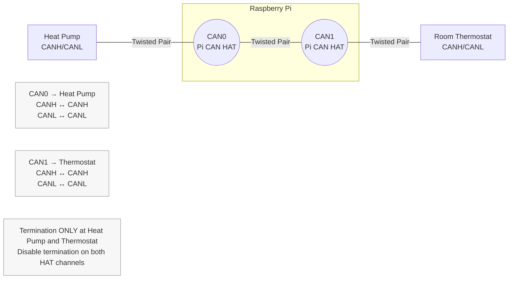

# Raspberry Pi CAN Bus Setup (Dual-Channel HAT)

This document describes how to expose `can0` and `can1` on a Raspberry Pi 3B using a dual‑channel MCP2515‑based CAN HAT.  
It is written for an in‑line installation between a Rotex/Daikin heat pump and its room thermostat.

---

## 1. Hardware Overview

The dual‑channel isolated CAN HAT provides:

- Two independent CAN interfaces (`CAN0` and `CAN1`)
- Two MCP2515 CAN controllers (SPI)
- Two isolated CAN transceivers
- Direct connection to the Raspberry Pi GPIO header (no manual wiring)

### CAN wiring (only part you wire manually)



- **CAN0_H → Heat pump CANH**  
- **CAN0_L → Heat pump CANL**  
- **CAN1_H → Thermostat CANH**  
- **CAN1_L → Thermostat CANL**

### Termination

- The heat pump and thermostat already terminate the bus.
- **Disable termination on both CAN channels on the HAT.**

---

## 2. Enable SPI

Edit `/boot/firmware/config.txt`:

```bash
dtparam=spi=on
```

---

## 3. Enable the MCP2515 CAN Controllers

Edit `/boot/firmware/config.txt` and add the overlays for both channels:

```bash
dtoverlay=mcp2515-can0,oscillator=16000000,interrupt=25
dtoverlay=mcp2515-can1,oscillator=16000000,interrupt=24
```

**Parameter explanation:**
- `oscillator=16000000` – The clock frequency (16 MHz) of the MCP2515 chip used for baud rate calculations. Not related to termination resistors.
- `interrupt=25` – The GPIO pin number on the Raspberry Pi that the MCP2515 uses to signal hardware interrupts when CAN messages arrive. Adjust these pins if your HAT uses different ones.

> Adjust interrupt pins if your HAT uses different ones.

Reboot:

```bash
sudo reboot
```

---

## 4. Bring Up the CAN Interfaces

Check that the interfaces exist:

```bash
ip link
```

You should see `can0` and `can1`.

### Set bitrate (Rotex/Daikin 20 kbit/s)

Create a startup script to persist these settings across reboots. Create `/opt/roconmqtt/setup-can.sh`:

```bash
#!/bin/bash
sleep 2  # Wait for interfaces to be ready
ip link set can0 up type can bitrate 20000
ip link set can1 up type can bitrate 20000
```

Make it executable:

```bash
sudo chmod +x /opt/roconmqtt/setup-can.sh
```

Create a systemd service file at `/etc/systemd/system/setup-can.service`:

```ini
[Unit]
Description=Setup CAN Interfaces
After=network.target

[Service]
Type=oneshot
ExecStart=/opt/roconmqtt/setup-can.sh
RemainAfterExit=yes

[Install]
WantedBy=multi-user.target
```

Enable the service:

```bash
sudo systemctl daemon-reload
sudo systemctl enable setup-can.service
sudo systemctl start setup-can.service
```

To manually verify the setup:

```bash
sudo ip link set can0 up type can bitrate 20000
sudo ip link set can1 up type can bitrate 20000
```

Verify: 

```bash
ip -details link show can0
```

Expected state:

- `ERROR-ACTIVE`  
- No `BUS-OFF`  
- No `ERROR-PASSIVE`

Typically:
```bash
root@rocon-g1:~# ip -details link show can0
3: can0: <NOARP,UP,LOWER_UP,ECHO> mtu 16 qdisc pfifo_fast state UNKNOWN mode DEFAULT qlen 10
    link/can
    can state ERROR-ACTIVE (berr-counter tx 0 rx 0) restart-ms 0
    bitrate 20000 sample-point 0.875
    tq 3125 prop-seg 6 phase-seg1 7 phase-seg2 2 sjw 1
    c_can: tseg1 2..16 tseg2 1..8 sjw 1..4 brp 1..1024 brp-inc 1
    clock 24000000
```

---

## 5. Install CAN Utilities

```bash
sudo apt install can-utils
```

This will install tools like `candump` and `cansend`.

---

## 6. Open up SSH and VNC on the PI

```bash
sudo raspi-config
```

Go to `3 Interface Options`, and enable SSH and VNC.

---

## 7. Notes for Rotex/Daikin Heat Pumps

- The CAN bus **must be linear**, not branched.
- Stub lengths must be **short (<30–50 cm)**.
- Incorrect topology will cause the thermostat to freeze.
- The Pi must sit **in-line** between heat pump and thermostat.

---

## 8. Summary

- Plug the HAT onto the Pi (no GPIO wiring needed).
- Wire CAN0 to the heat pump, CAN1 to the thermostat.
- Disable termination on the HAT.
- Enable SPI + MCP2515 overlays.
- Bring up `can0` and `can1` with the correct bitrate.
- Use SocketCAN tools (`candump`, `cansend`, python-can, etc.).

---

## 9. Troubleshooting

### Error: "Address family not supported by protocol" (EAFNOSUPPORT, errno 97)

This error occurs when the application cannot create an AF_CAN socket.

**Diagnostics:**

```bash
# 1. Check if CAN kernel modules are loaded
lsmod | grep can
```

Expected output:
```
can_raw                20480  0
can                    24576  1 can_raw
can_dev                49152  2 mcp251x,gs_usb
```

If empty, load the modules:
```bash
sudo modprobe can
sudo modprobe can_raw
sudo modprobe can_dev
```

```bash
# 2. Check if CAN interface exists and is UP
ip link show can0
```

Expected output:
```
3: can0: <NOARP,UP,LOWER_UP,ECHO> mtu 16 qdisc pfifo_fast state UP mode DEFAULT qlen 10
    link/can
```

If interface doesn't exist or is DOWN, check device tree overlays and run:
```bash
sudo ip link set can0 up type can bitrate 20000
```

```bash
# 3. Check kernel logs for CAN initialization errors
dmesg | grep -i can
dmesg | grep -i mcp
```

### MCP2515 Probe Failed

If you see:
```
mcp251x spi0.0: MCP251x didn't enter in conf mode after reset
mcp251x spi0.0: Probe failed, err=110
```

**Possible causes:**
- Wrong interrupt GPIO pin in `/boot/firmware/config.txt`
- SPI not enabled (`dtparam=spi=on`)
- Hardware connection issue
- Incorrect oscillator frequency

**If using USB CAN adapter instead:**
The MCP2515 error is expected and harmless if you're using a USB CAN adapter (like gs_usb/canable). The `can0` interface from the USB adapter will work normally.

### Interface State BUS-OFF or ERROR-PASSIVE

```bash
ip -details link show can0
```

If you see `BUS-OFF` or `ERROR-PASSIVE`:
- Check CAN bus termination (120Ω at both ends only)
- Verify CANH/CANL wiring (not swapped)
- Check bitrate matches all devices (20000 for Rotex/Daikin)
- Ensure linear topology (no star/branch connections)

### Permission Denied Errors

If the application runs but cannot send/receive CAN frames:

```bash
# Add user to 'can' group (replace 'rocon' with your username)
sudo usermod -a -G can rocon

# Create udev rule for automatic CAN group assignment
sudo nano /etc/udev/rules.d/90-can.rules
```

Add:
```
KERNEL=="can*", SUBSYSTEM=="net", GROUP="can", MODE="0660"
```

Reload udev:
```bash
sudo udevadm control --reload-rules
sudo udevadm trigger
```

### Testing CAN Communication

Before running the application, verify CAN is working:

```bash
# Terminal 1: Monitor all CAN traffic
candump can0

# Terminal 2: Send a test frame
cansend can0 123#DEADBEEF
```

If you see the frame in Terminal 1, SocketCAN is working correctly.
