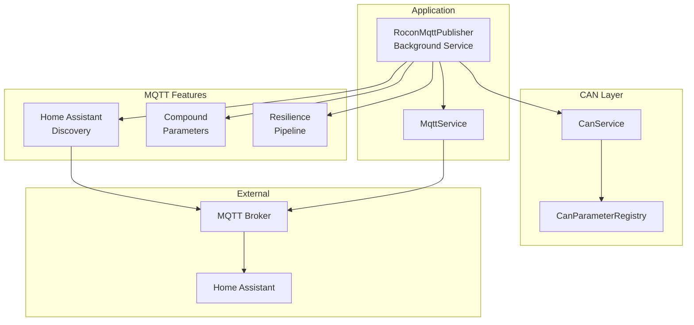
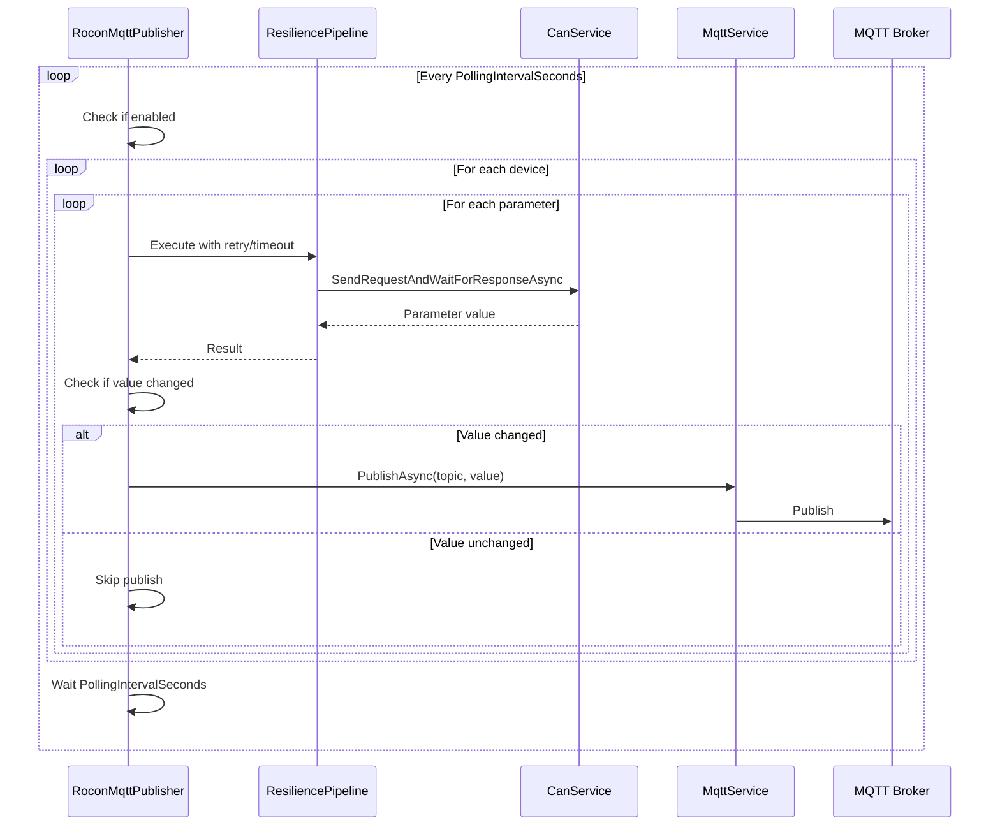

# MQTT Publisher & Home Assistant Integration

## Overview

The RoconMqtt system publishes CAN bus data from Rotex Rocon G1 heating controllers to MQTT brokers with automatic Home Assistant discovery support. This document describes the MQTT architecture, publishing patterns, Home Assistant integration, and compound parameters.

## System Architecture



## Publishing Flow

### 1. Startup Sequence

1. **Configuration Validation** - Validates devices and parameters lists
2. **Device Identifier Query** - Retrieves unique device identifiers (cGERAETE_KENNUNG)
3. **Home Assistant Discovery** - Publishes discovery messages (if enabled)
4. **Polling Loop** - Starts continuous parameter polling

### 2. Polling Cycle



## MQTT Topics

### State Topics

Format: `{Topic}/{DeviceId}/{ParameterName}/state`

**Example:**
```
rocon/12345678/cAUSSENTEMP/state
rocon/12345678/Timestamp/state
```

**Payload:**
```json
15.5
```

### Home Assistant Discovery Topics

Format: `{DiscoveryPrefix}/{Component}/rocon_{DeviceId}_{ParameterName}/config`

**Example:**
```
homeassistant/sensor/rocon_12345678_caussententp/config
```

**Payload:**
```json
{
  "name": "c_aussentemp",
  "unique_id": "rocon_12345678_cAUSSENTEMP",
  "object_id": "rocon_12345678_caussententp",
  "state_topic": "rocon/12345678/cAUSSENTEMP/state",
  "value_template": "{{ value }}",
  "unit_of_measurement": "°C",
  "device_class": "temperature",
  "state_class": "measurement",
  "device": {
    "identifiers": ["rocon_12345678"],
    "name": "Rotex Rocon 12345678",
    "manufacturer": "Daikin / Rotex",
    "model": "ROCON G1",
    "sw_version": "unknown"
  }
}
```

## Configuration

### Basic MQTT Configuration

```json
{
  "Mqtt": {
    "Enabled": true,
    "Host": "localhost",
    "Port": 1883,
    "UseTls": false,
    "ValidateCertificate": true,
    "ClientId": "rocon-mqtt-client",
    "Username": "optional-username",
    "Password": "optional-password",
    "KeepAlivePeriodSeconds": 30,
    "Topic": "rocon",
    "Devices": ["HG1", "HC1"],
    "Parameters": [
      "cAUSSENTEMP",
      "cVORLAUFTEMP",
      "cRUECKLAUFTEMP"
    ],
    "CompoundParameters": ["Timestamp"],
    "PollingIntervalSeconds": 30,
    "ResponseTimeoutSeconds": 1,
    "ChangeThresholdPercent": 1.0
  }
}
```

### Configuration Options

| Option | Type | Default | Description |
|--------|------|---------|-------------|
| `Enabled` | bool | `true` | Enable/disable MQTT publisher |
| `Host` | string | - | MQTT broker hostname or IP address |
| `Port` | int | `1883` | MQTT broker port (8883 for TLS) |
| `UseTls` | bool | `false` | Enable TLS/SSL encryption |
| `ValidateCertificate` | bool | `true` | Validate TLS certificate (false for self-signed) |
| `ClientId` | string | - | Unique MQTT client identifier |
| `Username` | string | `null` | Optional authentication username |
| `Password` | string | `null` | Optional authentication password |
| `KeepAlivePeriodSeconds` | int | `30` | MQTT keep-alive interval |
| `Topic` | string | - | Base topic for all publications |
| `Devices` | string[] | `[]` | List of devices to query (HG1-HG8, HC1-HC16, HCM1-HCM16) |
| `Parameters` | string[] | `[]` | List of parameters to query |
| `CompoundParameters` | string[] | `[]` | List of compound parameters to create |
| `PollingIntervalSeconds` | int | `30` | Interval between polling cycles |
| `ResponseTimeoutSeconds` | int | `1` | Timeout waiting for CAN response |
| `ChangeThresholdPercent` | double | `1.0` | Minimum change required to publish (%) |

### Home Assistant Configuration

```json
{
  "Mqtt": {
    "HomeAssistant": {
      "Discovery": true,
      "DiscoveryPrefix": "homeassistant",
      "DeviceIdentifierFormat": "rocon_{deviceId}",
      "DeviceNameFormat": "Rotex Rocon {deviceId}",
      "DeviceManufacturer": "Daikin / Rotex",
      "DeviceModel": "ROCON G1",
      "DeviceSoftwareVersion": "unknown",
      "UniqueIdFormat": "rocon_{deviceId}_{parameterName}",
      "ObjectIdFormat": "rocon_{deviceId}_{parameterName}",
      "ValueTemplate": "{{ value }}"
    }
  }
}
```

### Home Assistant Options

| Option | Type | Default | Description |
|--------|------|---------|-------------|
| `Discovery` | bool | `true` | Enable Home Assistant MQTT Discovery |
| `DiscoveryPrefix` | string | `homeassistant` | Discovery topic prefix |
| `DeviceIdentifierFormat` | string | - | Template for device identifier |
| `DeviceNameFormat` | string | - | Template for device display name |
| `DeviceManufacturer` | string | - | Device manufacturer name |
| `DeviceModel` | string | - | Device model name |
| `DeviceSoftwareVersion` | string | - | Device software version |
| `UniqueIdFormat` | string | - | Template for entity unique ID |
| `ObjectIdFormat` | string | - | Template for entity object ID |
| `ValueTemplate` | string | `{{ value }}` | Jinja2 template to extract value |

## Change Detection & Publishing Logic

### Change Threshold

The publisher only publishes values that have changed significantly to reduce MQTT traffic and unnecessary updates.

**Numeric Values (int, double):**
```csharp
threshold = ChangeThresholdPercent / 100.0
change = |newValue - lastValue|
referenceValue = max(|lastValue|, 0.001)  // Prevent division by zero
shouldPublish = (change / referenceValue) > threshold
```

**Example with 1% threshold:**
- Last value: `20.0`
- New value: `20.15` ? Change: `0.75%` ? **Skip publish**
- New value: `20.25` ? Change: `1.25%` ? **Publish**

**Complex Objects:**
- Serializes both values to JSON
- Compares JSON strings
- Publishes if different

### First Value

The first value for any parameter is always published regardless of threshold.

## Compound Parameters

Compound parameters combine multiple individual CAN parameters into a single synthetic value. This is useful for creating complex entities that don't have a direct mapping to a single CAN parameter.

### Available Compound Parameters

#### Timestamp

Combines date and time parameters into an ISO 8601 timestamp.

**Source Parameters:**
- `cTAG` - Day (1-31)
- `cMONAT` - Month (1-12)
- `cJAHR` - Year (0-99, represents 2000-2099)
- `cSTUNDE` - Hour (0-23)
- `cMINUTE` - Minute (0-59)
- `cSEKUNDE` - Second (0-59)

**Output Format:** `2024-12-20T14:30:45`

**Home Assistant Configuration:**
- Component: `sensor`
- Device Class: `timestamp`
- No unit of measurement

**MQTT Topic Example:**
```
rocon/12345678/Timestamp/state
```

**Payload:**
```json
"2024-12-20T14:30:45"
```

### Creating Custom Compound Parameters

1. **Create a class implementing `ICompoundParameter`:**

```csharp
public class MyCompoundParameter : ICompoundParameter
{
    public string Name => "MyParameter";
    public string[] SourceParameters => ["cPARAM1", "cPARAM2"];
    public string HomeAssistantComponent => "sensor";
    public string? UnitOfMeasurement => "kW";
    public string? DeviceClass => "power";
    public string? StateClass => "measurement";
    
    public object CombineValues(Dictionary<string, object?> values)
    {
        var param1 = (double)values["cPARAM1"];
        var param2 = (double)values["cPARAM2"];
        return param1 + param2;  // Example: sum
    }
}
```

2. **Register in `CompoundParameterFactory`:**

```csharp
return parameterName switch
{
    "Timestamp" => new TimestampCompoundParameter(),
    "MyParameter" => new MyCompoundParameter(),
    _ => throw new ArgumentException(...)
};
```

3. **Add to configuration:**

```json
{
  "Mqtt": {
    "CompoundParameters": ["Timestamp", "MyParameter"]
  }
}
```

## Resilience & Error Handling

### Resilience Pipeline

The publisher uses Polly resilience pipelines to handle transient failures:

**Features:**
- **Retry**: Automatic retries with exponential backoff
- **Circuit Breaker**: Prevents overwhelming failing devices
- **Timeout**: Enforces response timeout per query

### Error Scenarios

| Scenario | Behavior | Log Level |
|----------|----------|-----------|
| Circuit breaker open | Skip query, log warning | Warning |
| Response timeout | Retry, then skip | Warning |
| Parameter not found | Log error, skip discovery | Error |
| MQTT publish error | Log error, continue | Error |
| Device offline | Circuit breaker opens after retries | Warning |

### Log Event IDs

| Event ID | Level | Message |
|----------|-------|---------|
| 4001 | Information | Publisher started |
| 4002 | Warning | No devices configured |
| 4003 | Warning | No parameters configured |
| 4004 | Warning | Timeout waiting for answer |
| 4005 | Error | Error querying device |
| 4006 | Information | Cancellation requested |
| 4007 | Error | Error in polling loop |
| 4008 | Information | Publisher stopped |
| 4009 | Debug | Publishing to MQTT topic |
| 4010 | Warning | Circuit breaker open for query |
| 4011 | Debug | Publisher disabled |
| 4012 | Debug | Value unchanged, skipping publish |
| 4013 | Information | Publishing Home Assistant discovery |
| 4014 | Debug | Published discovery config |
| 4015 | Information | Querying device identifiers |
| 4016 | Information | Device identifier found |
| 4017 | Warning | Device identifier not found |
| 4018 | Error | Error querying device identifier |
| 4022 | Error | Parameter not found in registry |
| 4023 | Error | Missing Home Assistant metadata |
| 4024 | Warning | Skipping Home Assistant discovery |
| 4025 | Debug | Using compound parameter metadata |

## Home Assistant Integration

### Automatic Entity Creation

When Home Assistant discovery is enabled, the publisher automatically creates entities for all configured parameters.

**Supported Components:**
- `sensor` - Read-only numeric values
- `binary_sensor` - Boolean on/off states
- Additional components via parameter registry

### Entity Configuration

Each entity is configured with:
- **Unique ID**: Globally unique identifier
- **Object ID**: Entity ID in Home Assistant
- **State Topic**: MQTT topic for state updates
- **Device**: Grouped under device in Home Assistant UI
- **Metadata**: Unit, device class, state class from registry

### Example Entity in Home Assistant

**Configuration:**
```yaml
sensor:
  - unique_id: rocon_12345678_cAUSSENTEMP
    name: c_aussentemp
    state_topic: rocon/12345678/cAUSSENTEMP/state
    unit_of_measurement: "°C"
    device_class: temperature
    state_class: measurement
    device:
      identifiers: [rocon_12345678]
      name: Rotex Rocon 12345678
      manufacturer: Daikin / Rotex
      model: ROCON G1
```

**Result in Home Assistant:**
- Entity: `sensor.rocon_12345678_caussententp`
- Display: "c_aussentemp"
- Value: `15.5 °C`
- Device: "Rotex Rocon 12345678"

### Device Grouping

All parameters from the same device are grouped under a single device in Home Assistant:

```
Device: Rotex Rocon 12345678
??? c_aussentemp (15.5 °C)
??? c_vorlauftemp (45.0 °C)
??? c_ruecklauftemp (38.0 °C)
??? Timestamp (2024-12-20T14:30:45)
```

## Performance Optimization

### Polling Strategy

**Recommended Configuration:**
- `PollingIntervalSeconds`: `30-60` for most parameters
- `ResponseTimeoutSeconds`: `1-2` seconds
- `ChangeThresholdPercent`: `1.0` for temperature, `0.1` for precise values

### MQTT Traffic Reduction

1. **Change Detection**: Only publish values that exceed threshold
2. **Retained Messages**: Discovery messages are retained
3. **Efficient JSON**: Unindented JSON serialization
4. **Batch Processing**: All parameters processed in single cycle

### CAN Bus Efficiency

- Sequential queries prevent bus flooding
- Timeout enforcement prevents blocking
- Circuit breaker protects from slow devices
- Device identifier cached after first query

## Troubleshooting

### No Data Published

**Symptoms**: MQTT topics empty

**Checks:**
1. Verify `Mqtt.Enabled = true`
2. Check device names match CAN bus devices
3. Verify parameter names exist in registry
4. Review logs for timeout/error messages
5. Test CAN bus communication separately

### Home Assistant Entities Not Appearing

**Symptoms**: No entities created in Home Assistant

**Checks:**
1. Verify `HomeAssistant.Discovery = true`
2. Check discovery prefix matches Home Assistant (`homeassistant`)
3. Review logs for discovery errors (Event ID 4024)
4. Verify MQTT integration configured in Home Assistant
5. Check parameter has `HomeAssistantComponent` in registry

### High MQTT Traffic

**Symptoms**: Excessive MQTT publications

**Solutions:**
1. Increase `ChangeThresholdPercent` (default: 1%)
2. Increase `PollingIntervalSeconds` (default: 30s)
3. Remove unnecessary parameters
4. Use compound parameters for related data

### Circuit Breaker Triggered

**Symptoms**: "Circuit breaker open" warnings

**Causes:**
- Device offline or not responding
- CAN bus communication issues
- Network problems

**Solutions:**
1. Check device power and CAN bus connection
2. Verify correct device names
3. Increase timeout values
4. Review CAN bus documentation

## Best Practices

### Parameter Selection

? **Do:**
- Query only parameters needed for automation/monitoring
- Use compound parameters for related data
- Configure change threshold based on parameter variability

? **Don't:**
- Query all available parameters (~4800)
- Use very low polling intervals (<10s)
- Set change threshold to 0% (publishes every value)

### Home Assistant Integration

? **Do:**
- Use descriptive device names in configuration
- Set appropriate device classes for parameters
- Group related parameters under same device

? **Don't:**
- Change unique IDs after entities created
- Use special characters in device identifiers
- Disable discovery without removing entities first

### Security

? **Do:**
- Use TLS for production MQTT brokers
- Configure authentication (username/password)
- Validate certificates on production systems
- Use firewall rules to restrict MQTT access

? **Don't:**
- Expose MQTT broker to public internet
- Use default credentials
- Disable certificate validation in production
- Share ClientId between multiple instances

## Examples

### Minimal Configuration

```json
{
  "Mqtt": {
    "Host": "localhost",
    "ClientId": "rocon-mqtt",
    "Topic": "rocon",
    "Devices": ["HG1"],
    "Parameters": ["cAUSSENTEMP"]
  }
}
```

### Production Configuration

```json
{
  "Mqtt": {
    "Enabled": true,
    "Host": "mqtt.example.com",
    "Port": 8883,
    "UseTls": true,
    "ValidateCertificate": true,
    "ClientId": "rocon-mqtt-prod-01",
    "Username": "rocon-publisher",
    "Password": "${MQTT_PASSWORD}",
    "Topic": "rocon/production",
    "Devices": ["HG1", "HC1", "HC2"],
    "Parameters": [
      "cAUSSENTEMP",
      "cVORLAUFTEMP",
      "cRUECKLAUFTEMP",
      "cWARMWASSERTEMP",
      "cKESSELTEMP"
    ],
    "CompoundParameters": ["Timestamp"],
    "PollingIntervalSeconds": 60,
    "ResponseTimeoutSeconds": 2,
    "ChangeThresholdPercent": 0.5,
    "HomeAssistant": {
      "Discovery": true,
      "DiscoveryPrefix": "homeassistant",
      "DeviceIdentifierFormat": "rocon_{deviceId}",
      "DeviceNameFormat": "Heating Controller {deviceId}",
      "DeviceManufacturer": "Daikin / Rotex",
      "DeviceModel": "ROCON G1",
      "DeviceSoftwareVersion": "1.0"
    }
  }
}
```

### Home Assistant Automation Example

```yaml
automation:
  - alias: "Heating Alert - Low Outside Temperature"
    trigger:
      - platform: numeric_state
        entity_id: sensor.rocon_12345678_caussententp
        below: -5
    action:
      - service: notify.mobile_app
        data:
          title: "Heating Alert"
          message: "Outside temperature dropped to {{ states('sensor.rocon_12345678_caussententp') }}°C"
```

## See Also

- [CAN Bus Communication](CAN.md) - CAN protocol and parameter registry
- [API Documentation](API.md) - REST API for manual queries
- [Deployment Guide](DEPLOYMENT.md) - Installation and deployment
- [Hardware Setup](HARDWARE.md) - CAN interface hardware

## References

- [Home Assistant MQTT Discovery](https://www.home-assistant.io/integrations/mqtt/#mqtt-discovery)
- [MQTT Protocol](https://mqtt.org/)
- [Polly Resilience](https://github.com/App-vNext/Polly)
